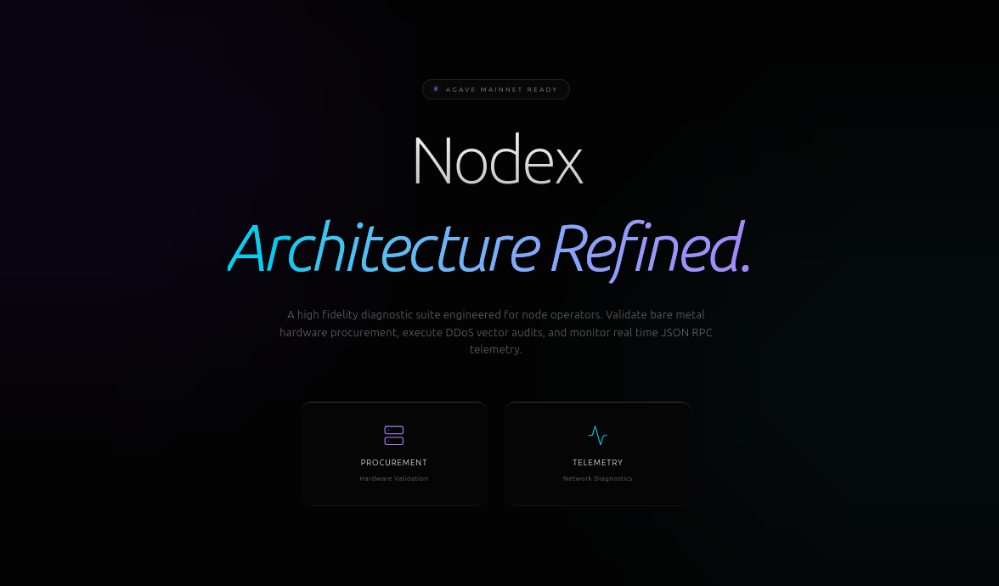

# ⬡ Nodex

**High Fidelity Validator Diagnostics & Telemetry**

> An automated diagnostic suite designed to bridge the gap between protocol theory and high performance validator management. Built specifically for the 400ms block production era of the Solana Agave client.

 

 

##  System Overview

This platform acts as a digital consultant for Solana node operators. It evaluates whether proposed bare metal architecture can meet the intense hardware demands of the network, and monitors the live performance of remote endpoints. By providing clear data driven feedback, it prevents configuration errors that lead to validator delinquency and degraded cluster performance. The application is divided into three core micro tools, each addressing a critical phase of the node lifecycle from procurement to deployment and ongoing security.

 

##  Core Modules & Engineering

### Hardware Procurement Advisor
The procurement module was engineered to prevent capital misallocation before deployment by evaluating proposed architecture constraints against Mainnet Beta requirements. Rather than implementing simple boolean checks, the rules based engine evaluates the interaction between variables. It detects complex configuration pitfalls, such as pairing NVMe storage with cloud environments susceptible to IOPS throttling. To bridge the gap between diagnostics and application, the engine dynamically compiles an optimised `agave-validator` bash startup script tailored to the exact hardware state, applying vital memory management flags if limited resources are detected. Operators can export these specifications directly to a JSON blob for data centre pricing quotes.

### Network Telemetry & Benchmarking
The telemetry dashboard provides live diagnostic pings to Solana endpoints via the standard JSON RPC 2.0 protocol. To provide comparative data analysis, the frontend leverages concurrent fetch requests to benchmark a custom endpoint against the public Mainnet baseline simultaneously, preventing network waterfalls. Session latency is continuously mapped via Recharts to provide high frequency data visualisation. To ensure strict data portability, a DOM based generation algorithm allows operators to export raw session telemetry directly to CSV files without requiring a backend processor.

### DDoS Vulnerability Auditor
Directly addressing the threat of distributed denial of service vectors within the global gossip network, the auditor leverages the native Node.js `net` module to execute asynchronous TCP handshakes against target IP addresses. This safely probes standard RPC and PubSub ports to ensure strict firewall configurations are active before the node broadcasts its presence to the global cluster.

 

##  Architecture & Security

The application utilises a modern MERN stack architecture to ensure high availability and low latency data processing. To satisfy strict non functional security requirements and protect public infrastructure, a dual layer rate limiting architecture is actively enforced. Express middleware securely throttles backend route execution to prevent endpoint exhaustion, while React state manages strict UI cooldowns. This comprehensively mitigates the risk of inadvertent network flooding or host IP blacklisting during active penetration testing.

### Technology Stack

| Layer | Technology | Purpose |
| :--- | :--- | :--- |
| **Frontend** | React, Tailwind v4, Recharts | Responsive SPA with complex state management and SVG data visualisation. |
| **Backend** | Node.js, Express, Net | API routing, concurrent request handling, and TCP socket generation. |
| **Security** | express-rate-limit | Strict request throttling to protect public Solana nodes. |
| **Testing** | Vitest, Jest, Supertest | Automated client DOM verification and backend route validation. |

 

##  Cloud Deployment Architecture

To ensure high availability and absolute separation of concerns, the platform abandons monolithic hosting in favour of a decoupled serverless architecture. The React application is compiled into highly optimised static assets and distributed globally via the Vercel Content Delivery Network, ensuring instant client side routing regardless of user geography. Simultaneously, the Node.js API gateway operates as an isolated web service on Render. This backend handles all complex TCP socket generation and MongoDB database interactions securely behind restrictive CORS policies, keeping sensitive logic entirely hidden from the public client.